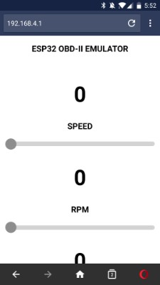
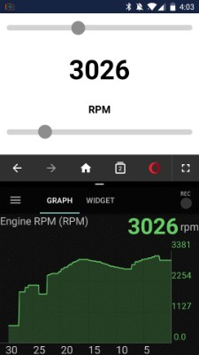
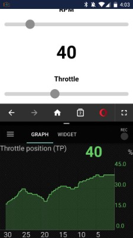
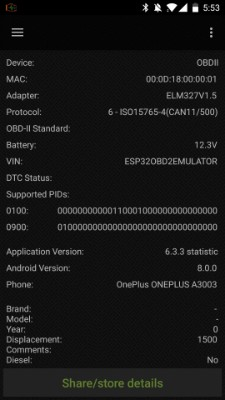
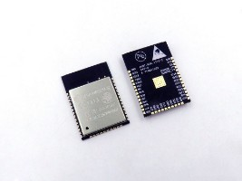
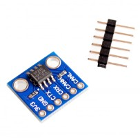
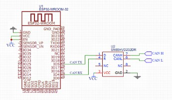

# ESP32 OBD-II Emulator

Open-source OBD-II emulator based on an ESP32 + CAN transceiver IC, controllable via WiFi through a simple web UI (or via API).

   

## Supported protocols
- ISO 15765-4 CAN (11 bit, 500 Kbps)

## Supported modes & PIDs
| Mode | PID  | Description                         |
|------|------|-------------------------------------|
| 0x01 | 0x0C | RPM                                 |
| 0x01 | 0x0D | Vehicle speed                       |
| 0x01 | 0x11 | Throttle position                   |
| 0x09 | 0x02 | Vehicle Identification Number (VIN) |

## Usage
1. Connect to the WiFi network `ESP32-OBD2` (with password `88888888`)
2. Navigate to `192.168.4.1`
3. Enjoy :)

## Hardware
- ESP32-WROOM-32
- SN65HVD230 (or any other CAN transceiver IC)
- Serial->USB adapter
- Power supply (3.3V)

### Connections
- IO 4 -> CAN RX
- IO 5 -> CAN TX

## Flash / Install (via [esptool](https://github.com/espressif/esptool))
1. Download the latest release binaries
2. Flash (app, bootloader, FAT filesystem): `esptool.py write_flash --flash_mode dio --flash_freq 40m --flash_size detect 0x1000 bootloader.bin 0x10000 obd2-emu.bin 0x8000 partitions.bin 0x110000 fatfs_image.img`

## Build
1. Install the [Espressif IoT Development Framework](https://github.com/espressif/esp-idf)
2. Clone this repo: `git clone ...`
3. (Optional) Configure: `make menuconfig`
4. Build: `make all`
5. Flash: `make flash`
6. Build & flash FAT image: `make flashfatfs`

**Note:** You might want to change some config values, for example: serial flasher, baud rate, pins, etc.

## API

PATCH `/api/vehicle`
- Content-Type: x-www-form-urlencoded
- Data:
  - `name`
    - speed
    - rpm
    - throttle
    - vin
  - `value`
- Example (CURL): `curl -XPATCH -H 'Content-Type: application/x-www-form-urlencoded' -d 'name=speed&value=50' '/api/vehicle'`

## Acknowledgements

- [ESP32-CAN-Driver](https://github.com/ThomasBarth/ESP32-CAN-Driver)
- [ESP32_makefatfs](https://github.com/jkearins/ESP32_mkfatfs)
- [esp32-http-server](https://github.com/igrr/esp32-http-server)
- [Espressif IoT Development Framework](https://github.com/espressif/esp-idf)
- [OBDSim](https://icculus.org/obdgpslogger/obdsim.html)